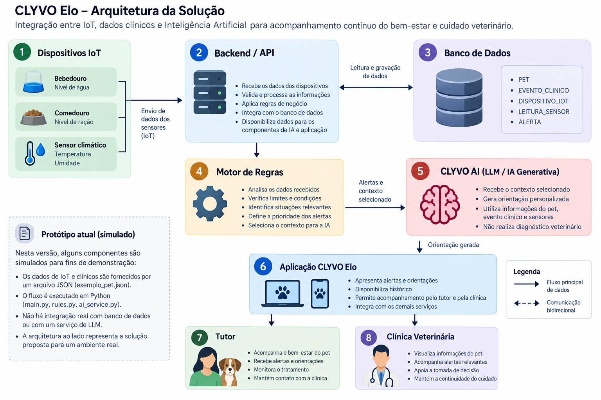

# CLYVO Elo — IA & IoT

Projeto desenvolvido para o Challenge da FIAP na disciplina **Disruptive Architectures: IoT, IoB & Generative IA**.

O CLYVO Elo propõe manter o vínculo entre a clínica veterinária e o tutor nos intervalos entre consultas, utilizando acompanhamento clínico, dispositivos IoT e Inteligência Artificial.

---

## 1. Sobre o projeto

O **CLYVO Elo** é uma solução de acompanhamento contínuo do cuidado veterinário.

A proposta atua em três frentes principais:

- **Preventivo:** lembretes de vacinação, vermífugo e check-ups;
- **Continuidade terapêutica:** acompanhamento de medicamentos, orientações veterinárias e cuidados pós-operatórios;
- **Bem-estar contínuo:** utilização de sensores IoT para monitoramento de água, ração e condições ambientais.

Dentro dessa solução, o **CLYVO AI** representa o componente inteligente responsável por analisar informações do pet, identificar situações relevantes e produzir orientações contextualizadas para o tutor.

---

## 2. Problema

Grande parte do acompanhamento de um pet acontece fora da clínica veterinária.

Nesse período, alterações no consumo de água e ração, condições ambientais ou informações relacionadas ao tratamento podem passar despercebidas.

Além disso, dados isolados de sensores nem sempre são facilmente interpretados pelo tutor.

O CLYVO Elo busca transformar esses dados em informações compreensíveis e priorizadas, permitindo maior continuidade no acompanhamento do animal.

---

## 3. Solução proposta

A solução combina dados provenientes de:

- perfil do pet;
- histórico e eventos clínicos;
- dispositivos IoT;
- leituras de sensores;
- alertas registrados.

Esses dados são processados inicialmente por um **motor de regras**, responsável por detectar condições relevantes.

Os resultados podem então ser utilizados pelo componente **CLYVO AI**, cuja arquitetura proposta prevê integração com um modelo de linguagem (LLM) para geração de orientações personalizadas.

---

## 4. Papel da Inteligência Artificial

A arquitetura proposta utiliza uma abordagem híbrida:

**Motor de Regras + IA Generativa baseada em LLM**

O motor de regras é responsável por condições objetivas, como:

- nível de água abaixo do esperado;
- nível de ração abaixo do esperado;
- temperatura elevada;
- umidade fora da faixa esperada;
- existência de acompanhamento pós-operatório.

A IA Generativa é proposta como uma camada posterior, responsável por transformar alertas e contexto em uma mensagem de linguagem natural personalizada para o tutor.

Essa separação permite manter condições críticas explícitas e testáveis, enquanto a IA é utilizada principalmente para contextualização e comunicação.

> **Importante:** o protótipo atual simula a camada de geração de orientação. Não há chamada a um LLM externo nesta versão.

---

## 5. IoT e dados monitorados

A arquitetura do CLYVO Elo prevê dispositivos IoT para acompanhamento do ambiente e dos recursos disponíveis ao pet.

No protótipo são considerados:

- nível de água;
- nível de ração;
- temperatura ambiente;
- umidade.

Os dispositivos previstos incluem:

- bebedouro inteligente;
- comedouro inteligente;
- sensor climático.

Na versão atual, as leituras dos dispositivos são simuladas através de arquivos JSON.

---

## 6. Arquitetura

A arquitetura proposta integra dispositivos IoT, backend, banco de dados, motor de regras e Inteligência Artificial.



Fluxo principal:

```text
Sensores IoT
     ↓
Backend / API CLYVO Elo
     ↓
Banco de Dados
     ↓
Motor de Regras
     ↓
Alertas + Contexto
     ↓
CLYVO AI / LLM
     ↓
Aplicação CLYVO Elo
     ↓
Tutor / Clínica Veterinária
```

A documentação detalhada da proposta está disponível em:

`docs/proposta-ia.md`

---

## 7. Estrutura do repositório

```text
clyvo-elo-ai/
│
├── app/
│   ├── main.py
│   ├── rules.py
│   └── ai_service.py
│
├── data/
│   ├── exemplo_pet.json
│   ├── cenario_normal.json
│   ├── cenario_alerta.json
│   └── cenario_pos_operatorio.json
│
├── docs/
│   ├── arquitetura-clyvo-ai.png
│   └── proposta-ia.md
│
├── README.md
├── requirements.txt
└── .gitignore
```

### Principais componentes

- `main.py` — controla a execução do protótipo;
- `rules.py` — implementa o motor de regras;
- `ai_service.py` — representa a camada de geração de orientação;
- `data/` — contém os dados simulados;
- `docs/` — contém documentação técnica e arquitetura.

---

## 8. Tecnologias utilizadas

### Linguagem

- Python

### Dados

- JSON

### Versionamento

- Git
- GitHub

### Conceitos utilizados

- Internet das Coisas (IoT);
- Inteligência Artificial Generativa;
- Large Language Models (LLM);
- motor de regras;
- personalização baseada em contexto;
- processamento de dados estruturados.

---

## 9. Como executar

### Pré-requisitos

É necessário possuir o Python instalado.

Clone o repositório:

```bash
git clone https://github.com/Jsantanadsx/clyvo-elo-ai.git
```

Entre na pasta:

```bash
cd clyvo-elo-ai
```

Execute:

```bash
python app/main.py
```

Em alguns ambientes Windows também é possível utilizar:

```bash
py app/main.py
```

O sistema apresentará os cenários disponíveis:

```text
1 - Cenário normal
2 - Cenário com alertas ambientais
3 - Cenário pós-operatório
```

Digite o número desejado para executar a análise.

---

## 10. Demonstração

O protótipo possui três cenários simulados.

### Cenário 1 — Normal

Representa um pet cujos dados monitorados estão dentro dos parâmetros esperados.

**Resultado esperado:**

- nenhum alerta relevante;
- orientação para manutenção do acompanhamento.

### Cenário 2 — Alertas ambientais

Representa alterações simultâneas nos dados monitorados.

São simulados:

- nível de água baixo;
- nível de ração baixo;
- temperatura elevada;
- umidade fora da faixa esperada.

**Resultado esperado:**

- identificação dos quatro eventos;
- classificação dos alertas por prioridade;
- geração de orientação para o tutor.

### Cenário 3 — Pós-operatório

Representa o pet Bolt em acompanhamento após procedimento veterinário.

O cenário combina:

- nível de água baixo;
- nível de ração baixo;
- evento clínico de pós-operatório.

**Resultado esperado:**

- identificação dos alertas ambientais;
- identificação do contexto clínico;
- geração de orientação contextualizada.

---

## 11. Resultados parciais

O protótipo atual consegue:

1. carregar informações simuladas do pet;
2. processar dados de sensores IoT;
3. considerar informações clínicas;
4. aplicar regras de negócio;
5. identificar alterações;
6. classificar alertas por prioridade;
7. combinar contexto clínico e ambiental;
8. produzir uma orientação personalizada;
9. diferenciar diferentes cenários de acompanhamento.

A implementação funciona como uma **prova de conceito da arquitetura proposta**.

---

## 12. Limitações do protótipo

A versão atual possui algumas limitações.

Os sensores IoT não são dispositivos físicos nesta etapa. Seus dados são simulados através de arquivos JSON.

Também não existe integração com um serviço externo de LLM.

O arquivo `ai_service.py` simula a camada responsável pela geração da orientação que, na arquitetura completa, poderá ser integrada a um modelo generativo.

O sistema não realiza diagnóstico veterinário.

As informações geradas possuem caráter de apoio e não substituem avaliação realizada por um médico-veterinário.

---

## 13. Evoluções futuras

Entre as possíveis evoluções estão:

- integração com dispositivos IoT reais;
- comunicação dos sensores com uma API;
- integração com banco de dados;
- integração real com API de LLM;
- histórico temporal das leituras;
- personalização baseada no histórico individual do pet;
- notificações automáticas;
- dashboard para clínicas;
- aplicação mobile para tutores;
- identificação de padrões de comportamento;
- modelos preditivos utilizando dados adequados e validados.

---

## 14. Integrantes

Projeto desenvolvido para o Challenge FIAP.

**Integrantes:**

- João Victor Santana dos Santos — RM566063
- Gabriel Cabral Mendes Mariano — RM563230

---

## 15. Vídeo Pitch

Vídeo de apresentação do projeto e demonstração funcional:

**YouTube (não listado):**  
``

O vídeo apresenta:

- problema identificado;
- proposta do CLYVO Elo;
- utilização de IoT;
- papel da Inteligência Artificial;
- arquitetura da solução;
- demonstração funcional do protótipo;
- benefícios para tutor, clínica e pet.